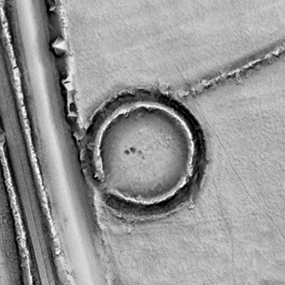
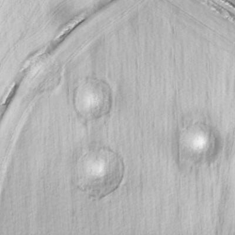
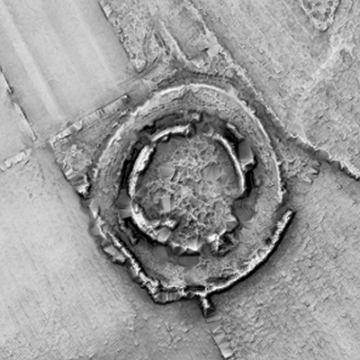

[](https://www.repostatus.org/#active) [](https://github.com/EarthObservation/adaf/blob/main/LICENSE.txt) [](https://www.python.org/downloads/release/python-370/)


# ADAF - Automatic Detection of Archaeological Features


A user-friendly software for the automatic detection of archaeological features from ALS data using convolutional neural
networks. The underlying ML models were trained on an extensive archive of ALS datasets in Ireland, labelled by experts
with three types of archaeological features (barrows, ringforts, enclosures). The core components of the tool are the
Relief Visualisation Toolbox (RVT) for processing the input data and the Artificial Intelligence Toolbox for Earth
Observation (AiTLAS), which provides access to the ML models.

  


# Installation

The installation is currently only supported on Windows 64-bit machines. The application is compatible with machines 
equipped with CUDA-enabled graphics cards, but will also work on a standard CPU where GPU processing is not possible.
We recommend creating a virtual environment with `Anaconda` and installing the requirements with `pip`. 
See the **Step by step instructions** below.


## Requirements
* Python 3.9 (recommended to use conda virtual environment: download and install
[Miniconda](https://docs.anaconda.com/free/miniconda/) or
[Anaconda](https://docs.anaconda.com/free/anaconda/install/windows/))

    > ADAF has been tested with Python 3.9. Newer Python versions should also work, but you will need to manually install a compatible version of the GDAL library. For details, refer to section 7 in the step-by-step instructions.

* Files with trained Machine learning models. Download from [Dropbox](https://www.dropbox.com/t/QRVtxUVTPRVSnYKK).

    > **Warning:** Download contains data with large file size **~5GB** in total. This includes 8 pretrained ML models saved as TAR files - 4 for semantic segmentation and 4 for object detection.


## Step by step instructions

1. Clone the repository to your local drive

2. Move the TAR files to `<path-to-repository>\adaf\ml_models`

    **Ensure that all files are copied to the exact specified location!**
    
    > Do not rename any files or extract the contents of the individual TAR files — they must remain intact.

3. Run Anaconda Prompt

    > To open the Anaconda Prompt you can press the `Windows` key, type “Anaconda Prompt”, and select the application from the search results.

4. In the Anaconda Prompt, navigate to the installation folder by running commands:
    
   ```bash
   cd <path-to-repository>
   ```
   
   `<path-to-repository>` is the location where you have downloaded and unzipped the installation files (for example `C:\temp\adaf\`)

5. Create and activate a conda environment called `adaf`. Run commands:

    ```bash
    conda create -n adaf python=3.9 -c conda-forge
    conda activate adaf
    ```
    
---
6. Install PyTorch for CUDA


    **Skip this step if you don’t have a CUDA enabled device!**

    > ONLY FOR CUDA COMPLIANT GPUs. When installing on a PC which has a CUDA enabled graphics card (check
    > [here](https://developer.nvidia.com/cuda-gpus) for
    > NVIDIA compliant cards) the GPU can be used to reduce processing times. If your card is compliant (also requires
    > installation of CUDA software that is not covered in this manual) install the compatible 
    > [PyTorch version](https://developer.nvidia.com/cuda-gpus).

---

7. Install required Python packages

    * GDAL
        ```bash
        conda install -c conda-forge gdal
        ```
        > Older Python versions: Wheel file for Python 3.8 is available in the folder `installation` and can be installed manualy using pip. 
    
    * AiTLAS
      This package instals AiTLAS and all other requirements for running ADAF (rasterio, jupyter notebooks, etc.)
        ```bash
        pip install ./isntallation/aitlas-0.0.1-py3-none-any.whl
        ```
   
8. Enable the use of the `adaf` virtual environment in Jupyter notebooks by running:

    ```bash   
    python -m ipykernel install --name adaf
    ```

9. Run Jupyter Notebook with the following command:

    ```bash   
    jupyter notebook ADAF_main.ipynb
    ```

# Contributing
Pull requests are welcome. For major changes, please open an issue first to discuss what you would like to change. Please report any bugs and suggestions for improvements.

# Acknowledgment
Development of ADAF financed by:
* Transport Infrastructure Ireland Open Research Call 2021.
* Slovenian Research and Innovation Agency core funding Earth Observation and geoinformatics (No. P2-0406).
* European Research Council project STONE (GAP-101089123)

# License
This project is licensed under the terms of the [Apache License 2.0](https://github.com/EarthObservation/adaf/blob/main/LICENSE.txt).

# About
ADAF - Automatic Detection of Archaeological Features library by Nejc Čož, Žiga Kokalj, Dragi Kocev, Ana Kostovska, 2024.

It is developed in collaboration between ZRC SAZU and Bias Variance Labs.
